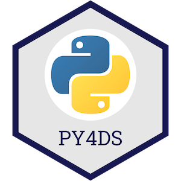

# 데이터 과학을 위한 파이썬 프로그래밍

**저자: [Tomas Beuzen](https://www.tomasbeuzen.com/) 🚀**

데이터 과학을 위한 파이썬 프로그래밍 과정에 오신 것을 환영합니다! 이 [웹사이트](https://www.tomasbeuzen.com/python-programming-for-data-science/)를 통해 데이터 과학에 파이썬을 활용하기 위해 알아야 할 모든 것을 소개하고자 합니다. 데이터 구조, 기본 프로그래밍, 코드 테스트 및 문서화, 데이터 탐색과 분석을 위한 NumPy와 Pandas 같은 라이브러리 사용법 등의 주제를 다룹니다.

<p align="center">
  
</p>

> 파이썬 패키지에 대해 더 배우고 싶다면 저와 [Tiffany Timber](https://www.tiffanytimbers.com/)가 함께 쓴 책 [**Python Packages**](https://py-pkgs.org/)를 확인해 보세요. 또한 파이썬과 PyTorch를 활용한 딥러닝에 관심이 있다면 제 다른 온라인 자료인 [**Deep Learning with PyTorch**](https://www.tomasbeuzen.com/deep-learning-with-pytorch/)를 참고하시기 바랍니다.

> 이 사이트의 콘텐츠는 제가 브리티시 컬럼비아 대학교(UBC)의 데이터 과학 석사 과정(MDS)에서 2020/2021년도 "DSCI 511 Python Programming for Data Science" 과목을 가르칠 때 사용했던 자료를 바탕으로 수정되었습니다. 해당 자료는 [Patrick Walls](https://www.math.ubc.ca/~pwalls/)와 [Mike Gelbart](https://www.mikegelbart.com/)가 이전에 개발한 강의 자료를 기초로 하여 만들어졌습니다.

## 주요 학습 목표

이 자료의 주요 학습 목표는 다음과 같습니다:

1. 반복문, 조건문 등과 같은 기본적인 프로그래밍 개념을 파이썬 코드로 구현할 수 있습니다.
2. 파이썬의 핵심 데이터 구조를 이해합니다.
3. 파이썬에서 함수를 작성하는 방법을 이해하고 단위 테스트를 통해 코드가 올바르게 작동하는지 평가합니다.
4. 코드를 더 모듈화하고 견고하게 만들기 위해 언제, 어떻게 추상화(예: 함수 또는 클래스로 분리)해야 하는지 숙지합니다.
5. 프로그래밍 관례, 문서화, 코딩 스타일의 모범 사례를 적용하여 사람이 읽기 쉬운 코드를 작성합니다.
6. NumPy를 사용하여 파이썬에서 일반적인 데이터 전처리 및 계산 작업을 수행합니다.
7. Pandas를 사용하여 Series와 DataFrame 같은 데이터 구조를 생성하고 조작합니다.
8. 숫자 데이터, 문자열, 날짜와 시간(datetimes) 등 다양한 형태의 데이터를 Pandas에서 다룹니다.

## 시작하기

본 사이트의 자료는 코드를 쉽게 실행해 볼 수 있도록 Jupyter Notebook으로 작성되었으며, [Quarto](https://quarto.org/)를 통해 빌드되었습니다. 만약 이 노트북 파일들을 로컬 컴퓨터에서 직접 실행해보고 싶다면 아래의 절차를 따라주세요:

1. GitHub 저장소를 클론합니다:
   ```sh
   git clone https://github.com/TomasBeuzen/python-programming-for-data-science.git
   ```
2. 터미널에 다음을 입력하여 conda 환경을 설치합니다:
   ```sh
   conda env create -f py4ds.yaml
   ```
3. 터미널에 다음을 입력하여 JupyterLab을 실행하고 강의 자료를 엽니다:
   ```sh
   cd python-programming-for-data-science
   jupyterlab
   ```

>`git`, `GitHub` 혹은 `conda` 사용이 익숙하지 않더라도 걱정하지 마세요. 이 웹사이트에서 제공되는 내용을 읽는 것만으로도 학습에는 전혀 지장이 없습니다!
